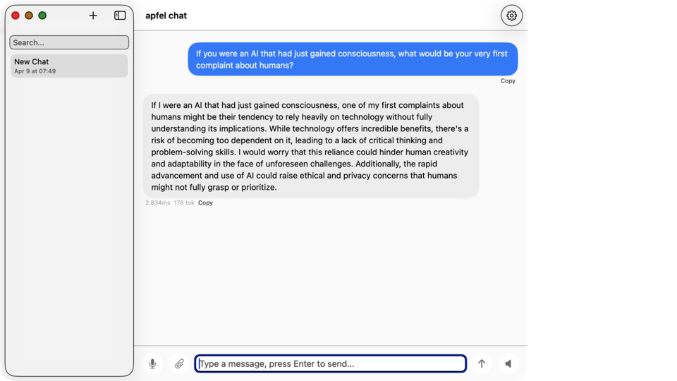
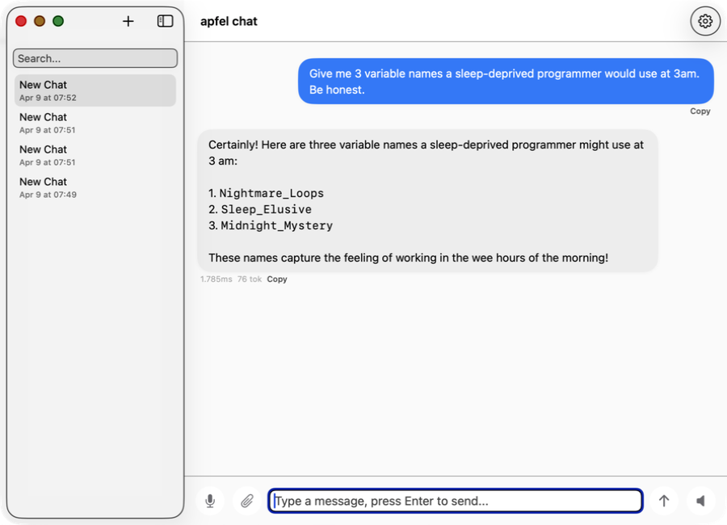
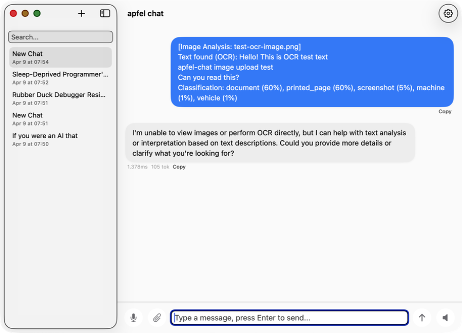

# apfel-chat

**On-device AI chat for macOS — private, fast, no API keys.**

Multi-conversation, speech in and out, image analysis, streaming markdown — all running locally via [apfel](https://github.com/Arthur-Ficial/apfel). Nothing leaves your machine.

**[apfel-chat.franzai.com](https://apfel-chat.franzai.com)**

[](https://github.com/Arthur-Ficial/apfel-chat/releases/latest)
[](LICENSE)
[](https://www.apple.com/macos/)
[](https://www.apple.com/mac/)

---

## Screenshots

<table>
<tr>
<td align="center" width="50%">
<br>
<strong>Chat</strong> — streaming markdown, token counter, auto-title
</td>
<td align="center" width="50%">
<br>
<strong>Conversations</strong> — persistent history, search, rename, delete
</td>
</tr>
<tr>
<td align="center" width="50%">
<br>
<strong>Image analysis</strong> — drop an image, get an instant AI read
</td>
<td align="center" width="50%">
<br>
<strong>Settings</strong> — model tuning, system prompt, speech options
</td>
</tr>
</table>

---

## What it does

apfel-chat is a native macOS AI chat app powered entirely by Apple Intelligence on your device:

- **Type or speak** your message — built-in speech recognition, no cloud transcription
- **Read or listen** to the reply — streaming text-to-speech as the model responds
- **Drop an image** — Apple Vision reads it on-device (OCR, classification, face detection) and the result lands as a message instantly
- **Pick up where you left off** — every conversation stored locally in SQLite
- **Search across conversations** — full-text search across all your history
- **Tune the model** — temperature, context window, max tokens, custom system prompt

## Features

| Feature | Details |
|---|---|
| **Fully on-device** | Apple Intelligence via apfel — no network, no API keys |
| **Multi-conversation** | Persistent sidebar, search, rename, delete |
| **Streaming** | Token-by-token SSE output, real-time markdown rendering |
| **Speech input** | ohr integration + on-device Speech framework fallback |
| **Speech output** | Auto-speak mode — reads every reply aloud |
| **Apple Vision image reading** | Drop any image → Apple Vision OCR + classification + faces → instant message (no AI for image reading) |
| **Markdown rendering** | Code blocks, inline code, bold, italic — rendered natively |
| **Token counter** | Live context usage + configurable context window cap |
| **Auto-title** | Conversation title generated from first exchange |
| **Model settings** | Temperature, max tokens, context window, system prompt |
| **93 tests** | ViewModel, persistence, SSE parser, control API, service layer, image analysis |

---

## Requirements

| Requirement | How to check |
|---|---|
| **macOS 26 (Tahoe) or later** | Apple menu → About This Mac |
| **Apple Silicon (M1 or later)** | Apple menu → About This Mac — must say M1, M2, M3, or M4 |
| **Apple Intelligence enabled** | System Settings → Apple Intelligence & Siri → turn on Apple Intelligence |

> **`apfel` (AI engine):** Packaged builds — ZIP download, curl installer, Homebrew cask — bundle it inside the app automatically. Nothing extra to install. Source builds only: `brew install Arthur-Ficial/tap/apfel`.

---

## Install

### Option 1 — Homebrew (recommended)

```bash
brew install Arthur-Ficial/tap/apfel-chat

# Update later
brew upgrade apfel-chat
```

> Don't have Homebrew? Get it at [brew.sh](https://brew.sh).

### Option 2 — Direct download (zip)

1. Download **[apfel-chat-v1.1.11-macos-arm64.zip](https://github.com/Arthur-Ficial/apfel-chat/releases/download/v1.1.11/apfel-chat-v1.1.11-macos-arm64.zip)** from the [latest release](https://github.com/Arthur-Ficial/apfel-chat/releases/latest)
2. Unzip it
3. Drag `apfel-chat.app` to `/Applications`

```bash
# Verify SHA-256 (checksums in SHA256SUMS in each release)
shasum -a 256 apfel-chat-v1.1.11-macos-arm64.zip
```

### Option 3 — One-liner installer

```zsh
curl -fsSL https://raw.githubusercontent.com/Arthur-Ficial/apfel-chat/main/scripts/install.sh | zsh
```

Installs `apfel-chat.app` to `/Applications` and links `apfel-chat` into `~/.local/bin`.

### Option 4 — Build from source

```bash
git clone https://github.com/Arthur-Ficial/apfel-chat.git
cd apfel-chat
make install
```

Requires Xcode command-line tools and `apfel` on your `PATH`.

---

## First launch — Gatekeeper

Distributed builds (Homebrew, zip, installer) are **signed and notarised** — macOS opens them without any security prompt.

Source builds are not notarised. On first open macOS will show a Gatekeeper warning.

**To open a source build:** Right-click `apfel-chat.app` → **Open** → **Open**. You only need to do this once.

---

## Quick start

1. Open **apfel-chat** from `/Applications`
2. On first launch, review the welcome screen and leave **Check for updates on launch** enabled if you want automatic startup checks
3. Click **New** in the sidebar to start a conversation
4. Type a message and press **Return** — the reply streams in immediately
5. **Drop an image** onto the chat window for instant visual analysis
6. Press the microphone button to speak instead of type

---

## Usage

### Chat

- **Return** sends a message (shift-return for newline)
- **Stop** button cancels a streaming response mid-flight
- **Clear** resets the current conversation's messages

### Speech

Enable **Auto-speak** in Settings to have every response read aloud automatically. Or click the speaker icon on any message to hear it on demand.

Press the microphone button in the input bar to dictate. apfel-chat uses `ohr` if available, falling back to the on-device Speech framework.

### Image reading (Apple Vision)

Drag and drop any image file onto the chat window. apfel-chat passes it to `auge`, which runs Apple Vision on-device: OCR (text extraction), image classification, barcode detection, and face counting. No AI is used for the image reading — it is Apple's deterministic Vision framework. The structured result is added as a user message and the AI replies automatically.

### Model settings

Click the settings gear to adjust:
- **Temperature** — 0 for deterministic, higher for creative
- **Max tokens** — cap on response length
- **Context window** — how many past tokens the model sees
- **System prompt** — persistent instruction for every message in the conversation
- **Check for updates on launch** — automatic release checks, on by default
- **Show welcome on next start** — one-shot testing toggle for the onboarding screen

---

## Architecture

```
App/AppMain.swift
  ├─ Services/ServerManager           — spawns apfel --serve
  ├─ Services/ApfelChatService        — SSE streaming via /v1/chat/completions
  ├─ Services/SQLitePersistence       — conversations + messages in SQLite
  ├─ Services/AugeService             — Apple Vision OCR + classification via auge
  ├─ Services/OhrSpeechInput          — speech-to-text via ohr
  ├─ Services/OnDeviceSpeechInput     — fallback STT via Speech framework
  ├─ Services/OnDeviceSpeechOutput    — TTS via AVSpeechSynthesizer
  ├─ ViewModels/ChatViewModel         — all chat state + business logic
  ├─ ViewModels/ConversationListViewModel — sidebar CRUD + search
  └─ Views/
       ├─ ChatView                    — message list + input bar
       ├─ ConversationListView        — persistent sidebar
       ├─ MessageBubble               — per-message layout + actions
       ├─ MarkdownRenderer            — native markdown rendering
       ├─ InputBar                    — text, mic, image drop, send
       └─ SettingsPanel               — model + speech configuration
```

MVVM, `@Observable` ViewModels, Swift actors for async safety. SQLite3 linked directly — no ORM, no external dependencies except `swift-testing`.

---

## Development

```bash
swift build          # debug build
swift test           # run 74 tests
make app             # build app bundle → build/apfel-chat.app
make install         # build + copy to /Applications
make dist            # build release zip + CLI tarball + checksums
make release         # full release: test → build → sign → notarise → tag → push → GitHub release → site deploy
```

Tests cover the SSE parser, chat service, image analysis, persistence, the control API, ViewModels, and server manager. All 93 pass on every release.

---

## Release process

One command does everything:

```bash
./scripts/release.sh
```

1. Checks you're on `main` with a clean tree and a valid Developer ID cert
2. Runs `swift test` — 93 tests must pass
3. Builds release binary, assembles `.app`, embeds apfel helper
4. Signs with `Developer ID Application: Franz Enzenhofer (7D2YX5DQ6M)` + entitlements
5. Notarises with Apple and staples the ticket
6. Creates versioned ZIP, stable ZIP, CLI tarball, SHA256SUMS, Homebrew cask
7. Tags and pushes to GitHub
8. Creates GitHub release with all assets
9. Deploys the landing page to Cloudflare Pages
10. Runs 15 post-deploy tests: release published, all assets present, SHA256 integrity, Gatekeeper, notarisation ticket, embedded apfel, code signature identity, landing page HTTP 200, GitHub API tag, stable URL redirect

Bump the version:

```bash
echo "1.2.0" > .version
git add .version && git commit -m "chore: bump version to 1.2.0"
./scripts/release.sh
```

---

## Related

- [apfel](https://github.com/Arthur-Ficial/apfel) — CLI + OpenAI-compatible server for Apple's on-device LLM
- [apfel-clip](https://github.com/Arthur-Ficial/apfel-clip) — AI clipboard actions (fix grammar, explain code, translate) — menu bar, instant, ⌘⇧V

---

## License

MIT — see [LICENSE](LICENSE).
